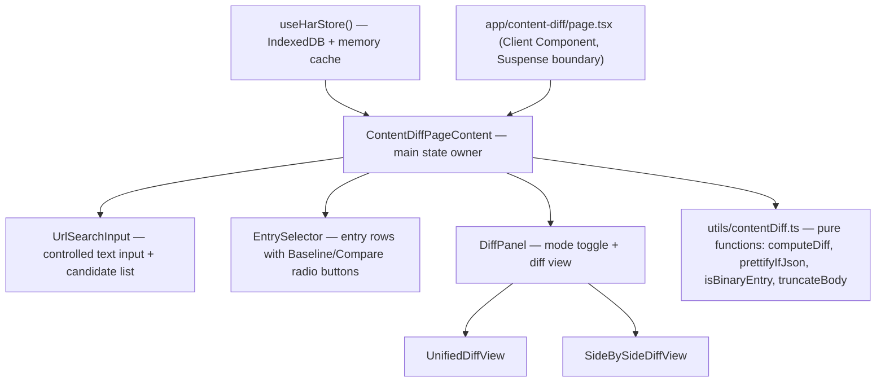

# Design Document — Content Diff

## Overview

The Content Diff feature adds a `/content-diff` page to the HAR Analyzer app. It lets users search for a URL, pick any two entries (from any HAR file or repeated requests to the same URL), and view a line-by-line diff of their response bodies with intra-line character/word highlighting, JSON auto-prettification, unified and side-by-side modes, line numbers, an "Identical" badge, binary/missing content fallback, and large-payload truncation.

All processing is entirely client-side. No new API routes, server actions, or backend changes are required. The page reads data exclusively from `useHarStore()` and the `diff` npm package.

**Key design decisions:**

- Use the `diff` npm package (`diffLines` + `diffWordsWithSpace`) — no external diff-UI library.
- Page component at `app/content-diff/page.tsx` as a client component, consistent with `/compare` and `/details`.
- In Next.js 16 `searchParams` is a `Promise`; client pages receive it as a prop and unwrap it with React `use()`.
- JSON prettification is a pure transform applied before content is passed to the diff engine.
- Truncation is applied per-entry, independently, before diffing.

---

## Architecture

The feature is entirely contained within the client-side React tree. There is no server component boundary introduced by this feature.



**Data flow:**

1. `useHarStore()` provides `HarStore` (all `HarAnalysis[]` and their `EntryRecord[]`).
2. `ContentDiffPageContent` derives unique URLs via `useMemo` and filters entries for the selected URL.
3. URL pre-population: on mount, `use(searchParams)` reads `?url=` and sets initial URL state.
4. Entry selection state (`baselineId`, `compareId`) drives `computeDiff` via `useMemo`.
5. Truncation state (`showFullBaseline`, `showFullCompare`) is toggled by the user; each flips independently.
6. The memoized `DiffResult` is passed to `DiffPanel`, which renders either `UnifiedDiffView` or `SideBySideDiffView`.

---

## Components and Interfaces

### Component Hierarchy

```
app/content-diff/page.tsx
└── <Suspense>
    └── ContentDiffPageContent          (owns all state)
        ├── Header / nav bar            (same pattern as /compare)
        ├── UrlSearchInput              (controlled input + candidate dropdown)
        ├── SelectedUrlBanner           (displays the active URL prominently)
        ├── EntrySelector               (two-column radio group: Baseline | Compare)
        │   └── EntryRow × N            (one per EntryRecord)
        └── DiffPanel                   (rendered when both entries are selected)
            ├── DiffModeToggle          (Unified | Side-by-Side button group)
            ├── IdenticalBadge          (shown when bodies are equal)
            ├── BinaryFallback          (shown when either entry is binary)
            ├── TruncationNotice × 0-2  (one per truncated entry)
            └── UnifiedDiffView | SideBySideDiffView
```

### `ContentDiffPageContent` — State

| State variable | Type | Description |
|---|---|---|
| `urlInput` | `string` | Controlled value of the search input |
| `selectedUrl` | `string \| null` | The currently active URL |
| `baselineId` | `string \| null` | Unique ID of the baseline entry |
| `compareId` | `string \| null` | Unique ID of the compare entry |
| `diffMode` | `'unified' \| 'side-by-side'` | Current diff layout mode |
| `showFullBaseline` | `boolean` | Whether baseline truncation is lifted |
| `showFullCompare` | `boolean` | Whether compare truncation is lifted |

### `UrlSearchInput` Props

```typescript
interface UrlSearchInputProps {
  value: string;
  candidates: string[];          // filtered unique URLs
  onChange: (v: string) => void;
  onSelect: (url: string) => void;
}
```

### `EntrySelector` Props

```typescript
interface EntrySelectorProps {
  entries: EntryRecord[];
  baselineId: string | null;
  compareId: string | null;
  onSelectBaseline: (id: string) => void;
  onSelectCompare: (id: string) => void;
}
```

### `DiffPanel` Props

```typescript
interface DiffPanelProps {
  baseline: EntryRecord;
  compare: EntryRecord;
  mode: 'unified' | 'side-by-side';
  showFullBaseline: boolean;
  showFullCompare: boolean;
  onToggleFullBaseline: () => void;
  onToggleFullCompare: () => void;
  onModeChange: (m: 'unified' | 'side-by-side') => void;
}
```

### `UnifiedDiffView` / `SideBySideDiffView` Props

```typescript
interface DiffViewProps {
  result: DiffResult;
}
```

---

## Data Models

### Entry identifier

Each `EntryRecord` is uniquely identified by the composite key:

```typescript
function entryId(e: EntryRecord): string {
  return `${e.harFileIndex}::${e.startedDateTime}::${e.url}`;
}
```

This is stable within a session (no mutation of the store after load).

### Core diff types (`utils/contentDiff.ts`)

```typescript
/** A single span of characters within a line, used for intra-line highlighting */
export interface IntraSpan {
  text: string;
  kind: 'equal' | 'removed' | 'added';
}

/** A single rendered line in the diff output */
export interface DiffLine {
  /** Line number in the source string (1-based), null for empty placeholder lines */
  lineNumber: number | null;
  /** Raw text of the line (without trailing newline) */
  text: string;
  /** Classification of this line */
  kind: 'equal' | 'removed' | 'added' | 'placeholder';
  /** Intra-line spans — populated only for 'removed' and 'added' lines that are
   *  paired with a matching change on the opposite side */
  spans: IntraSpan[];
}

/** A chunk groups contiguous lines of the same kind, for rendering efficiency */
export interface DiffChunk {
  kind: 'equal' | 'change' | 'placeholder';
  lines: DiffLine[];
}

/** Final output of computeDiff */
export interface DiffResult {
  /** Lines for the left (baseline) panel — used by SideBySideDiffView */
  leftLines: DiffLine[];
  /** Lines for the right (compare) panel — used by SideBySideDiffView */
  rightLines: DiffLine[];
  /** Interleaved lines for the unified view — used by UnifiedDiffView */
  unifiedLines: DiffLine[];
  /** True when baseline and compare bodies are byte-for-byte equal */
  identical: boolean;
  /** True when prettification was applied to at least one side */
  prettified: boolean;
}
```

### Binary content detection

```typescript
const BINARY_MIME_PREFIXES = [
  'image/', 'audio/', 'video/', 'font/',
  'application/octet-stream',
  'application/zip', 'application/pdf',
];

export function isBinaryEntry(entry: EntryRecord): boolean {
  const ct = entry.contentType ?? '';
  return (
    entry.responseContent === undefined ||
    BINARY_MIME_PREFIXES.some((p) => ct.startsWith(p))
  );
}
```

---

## Key Utility Functions (`utils/contentDiff.ts`)

### `prettifyIfJson`

```typescript
/**
 * Attempt to pretty-print a JSON body. Returns the prettified string when
 * the content type indicates JSON and the body parses successfully;
 * otherwise returns the original body unchanged.
 */
export function prettifyIfJson(body: string, contentType: string): {
  text: string;
  wasPrettified: boolean;
}
```

Algorithm:
1. If `contentType === 'application/json'` or `contentType.endsWith('+json')`, try `JSON.parse(body)`.
2. On success, return `{ text: JSON.stringify(parsed, null, 2), wasPrettified: true }`.
3. On `SyntaxError`, return `{ text: body, wasPrettified: false }`.
4. For non-JSON content types, return `{ text: body, wasPrettified: false }`.

### `truncateBody`

```typescript
const TRUNCATION_LIMIT = 50_000;

/**
 * Slice the body to TRUNCATION_LIMIT characters when showFull is false
 * and the body exceeds the limit.
 */
export function truncateBody(body: string, showFull: boolean): {
  text: string;
  wasTruncated: boolean;
  fullLength: number;
}
```

### `computeDiff`

```typescript
/**
 * Pure function: given two body strings (already prettified/truncated as needed),
 * compute the full DiffResult for rendering.
 *
 * Uses:
 *  - diffLines(baseline, compare)  for the line-level diff
 *  - diffWordsWithSpace(a, b)       for intra-line character spans
 */
export function computeDiff(baseline: string, compare: string): DiffResult
```

**Algorithm pseudocode:**

```
1. identical = (baseline === compare)

2. changes = diffLines(baseline, compare)
   // each change: { value: string, added?: boolean, removed?: boolean, count?: number }

3. Build parallel arrays: leftLines[], rightLines[], unifiedLines[]

4. For each change c in changes:
   a. Split c.value into individual line strings (split on '\n', drop trailing empty)

   b. If c.removed:
      - For each line text:
          leftLine = { lineNumber: leftLineNum++, text, kind: 'removed', spans: [] }
          push to leftLines, unifiedLines (unified shows '-' prefix via kind)
      - Push placeholder lines to rightLines (kind: 'placeholder') to maintain row alignment

   c. If c.added:
      - For each line text:
          rightLine = { lineNumber: rightLineNum++, text, kind: 'added', spans: [] }
          push to rightLines, unifiedLines
      - Push placeholder lines to leftLines for row alignment

   d. If neither (equal):
      - For each line text:
          push equal DiffLine to both leftLines, rightLines, unifiedLines

5. Intra-line diff pass:
   - Scan leftLines and rightLines in parallel by index
   - Where leftLine.kind === 'removed' AND rightLine.kind === 'added':
       leftSpans  = diffWordsWithSpace(leftLine.text, rightLine.text)
                    → map {removed: true} to IntraSpan{kind:'removed'}
                    → map {added: false, removed: false} to IntraSpan{kind:'equal'}
       rightSpans = diffWordsWithSpace(leftLine.text, rightLine.text)
                    → map {added: true} to IntraSpan{kind:'added'}
                    → map {removed: false, added: false} to IntraSpan{kind:'equal'}
       leftLine.spans  = leftSpans
       rightLine.spans = rightSpans

   NOTE: Placeholder lines at positions where one side has changes and the other
   doesn't are skipped in the intra-line pass (kind === 'placeholder').

6. Return { leftLines, rightLines, unifiedLines, identical, prettified }
```

### Usage in `ContentDiffPageContent`

```typescript
const diffResult = useMemo(() => {
  if (!baseline || !compare) return null;
  if (isBinaryEntry(baseline) || isBinaryEntry(compare)) return null;

  const baseBody = baseline.responseContent ?? '';
  const cmpBody  = compare.responseContent  ?? '';

  const { text: baseText } = prettifyIfJson(
    truncateBody(baseBody, showFullBaseline).text,
    baseline.contentType
  );
  const { text: cmpText } = prettifyIfJson(
    truncateBody(cmpBody, showFullCompare).text,
    compare.contentType
  );

  return computeDiff(baseText, cmpText);
}, [baseline, compare, showFullBaseline, showFullCompare]);
```

---

## Error Handling

| Scenario | Behaviour |
|---|---|
| No HAR files loaded | Show "No HAR data loaded — upload files to get started" message; hide URL search input |
| `?url=` param not found in store | Show "URL not found in loaded HAR data" message |
| URL search yields no matches | Show "No matching URLs" in candidate dropdown |
| Only one entry for selected URL | Show single entry metadata + "Only one entry available, diff requires two entries" message |
| Same entry selected for both roles | Show validation message; suppress diff panel |
| Either entry is binary / missing body | Show binary fallback with size comparison; suppress diff view |
| JSON parse failure during prettification | Silently fall back to raw body; no error shown to user |
| `diffLines` / `diffWordsWithSpace` throw | Caught in `computeDiff`; return `null` so caller can show "Diff failed" message |

---

## Testing Strategy

**Unit tests** cover specific examples, edge cases, and error conditions for the pure utility functions in `utils/contentDiff.ts`.

**Property-based tests** verify universal correctness properties using [fast-check](https://github.com/dubzzz/fast-check), which is the recommended PBT library for TypeScript projects. Each property test runs a minimum of 100 iterations.

Tag format for property tests: `Feature: content-diff, Property N: <property text>`

Example-based unit tests focus on:
- Correct rendering of a known diff (specific removed/added/equal lines)
- Binary entry detection for all recognised MIME prefixes
- JSON prettification: valid JSON, invalid JSON (fallback), non-JSON content type
- Truncation at exactly 50 000 chars, below limit, above limit
- `entryId` uniqueness for entries with different file indices or timestamps

Property tests (see Correctness Properties section) cover:
- Round-trip identity: diffing a string with itself
- Diff symmetry: line counts are consistent across baseline/compare sides
- Truncation invariants
- JSON prettification round-trip


---

## Correctness Properties

*A property is a characteristic or behavior that should hold true across all valid executions of a system — essentially, a formal statement about what the system should do. Properties serve as the bridge between human-readable specifications and machine-verifiable correctness guarantees.*

Property-based tests use [fast-check](https://github.com/dubzzz/fast-check) and run a minimum of 100 iterations each. Tag format: `Feature: content-diff, Property N: <property text>`.

---

### Property 1: URL filter completeness and soundness

*For any* list of URL strings and any query string, the URL filter function must return exactly the subset of URLs whose lowercase form contains the lowercase query — no more, no less.

**Validates: Requirements 1.2, 1.6**

---

### Property 2: Entry list completeness

*For any* HAR store and any URL selected from it, the number of entry rows produced equals the exact count of `EntryRecord` objects in the store whose `url` field matches exactly.

**Validates: Requirements 2.1, 2.2**

---

### Property 3: Entry metadata presence

*For any* `EntryRecord`, the rendered entry row must contain the entry's `harFileName`, `status`, `contentType`, a human-readable form of `contentSize`, and a UTC-formatted `startedDateTime`.

**Validates: Requirements 2.3**

---

### Property 4: Binary entry classification

*For any* `EntryRecord` whose `responseContent` is `undefined` or whose `contentType` starts with a binary MIME prefix, `isBinaryEntry()` must return `true`; and for any record with defined `responseContent` and a non-binary `contentType`, it must return `false`.

**Validates: Requirements 6.1, 6.2**

---

### Property 5: Identity detection

*For any* string `s`, `computeDiff(s, s).identical` must be `true`, all lines in `unifiedLines` must have `kind === 'equal'`, and `leftLines` must equal `rightLines` structurally.

**Validates: Requirements 4.1, 4.2, 4.3**

---

### Property 6: Diff line classification correctness

*For any* two strings `a` and `b`, every line that appears only in `a` must appear with `kind === 'removed'` in `computeDiff(a, b).leftLines`, and every line that appears only in `b` must appear with `kind === 'added'` in `rightLines`. Lines common to both must appear as `kind === 'equal'` on both sides.

**Validates: Requirements 5.2, 5.3**

---

### Property 7: Line numbers are assigned to all content lines

*For any* two strings, every `DiffLine` in the result with `kind !== 'placeholder'` must have a non-null `lineNumber` greater than zero, and line numbers must be strictly increasing within each side's line array.

**Validates: Requirements 5.5**

---

### Property 8: Intra-line spans populated for changed paired lines

*For any* two single-line strings that differ, `computeDiff` must produce at least one `DiffLine` with a non-empty `spans` array, and each span's `text` must be non-empty. Concatenating all span texts for a line must reconstruct the original line text.

**Validates: Requirements 5.8**

---

### Property 9: JSON prettification round-trip

*For any* JavaScript object that is valid JSON (i.e. `JSON.parse(JSON.stringify(obj))` does not throw), calling `prettifyIfJson(JSON.stringify(obj), 'application/json')` must return `wasPrettified === true` and `JSON.parse(result.text)` must deeply equal the original object.

**Validates: Requirements 5.9, 5.10**

---

### Property 10: Truncation correctness

*For any* string `s`:
- When `showFull === false` and `s.length > 50 000`, `truncateBody(s, false).text.length` must equal exactly 50 000 and `wasTruncated` must be `true`.
- When `showFull === true`, `truncateBody(s, true).text` must equal `s` exactly and `wasTruncated` must be `false`.
- When `s.length <= 50 000`, `truncateBody(s, false).text` must equal `s` and `wasTruncated` must be `false`.

**Validates: Requirements 7.1, 7.2, 7.3, 7.4**
